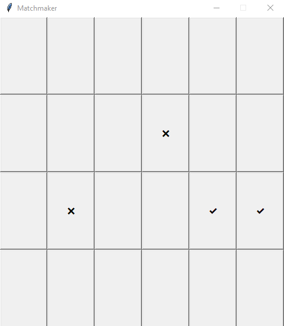
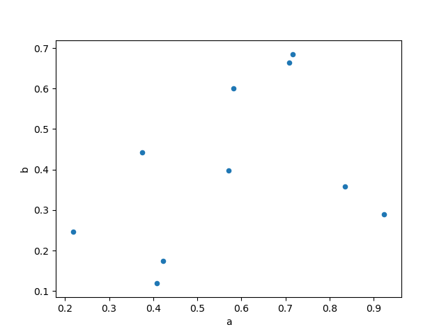
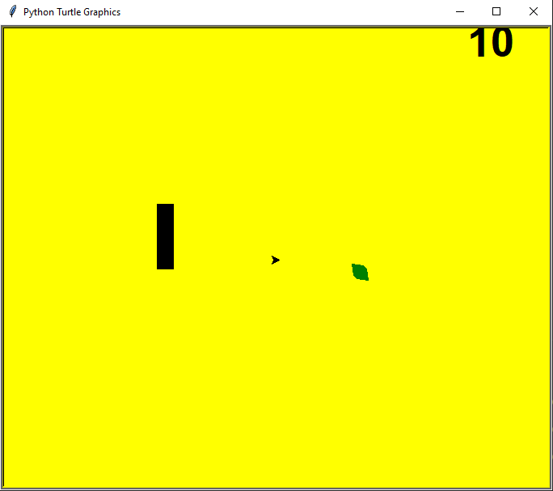
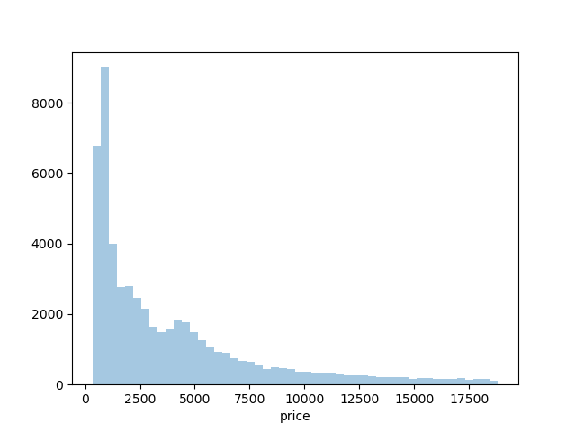
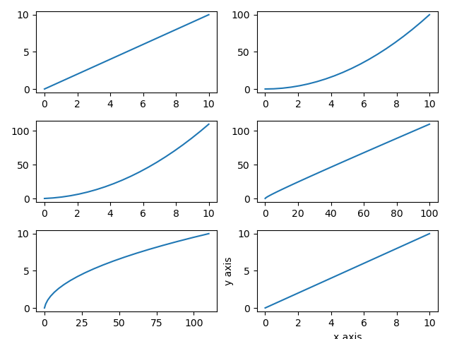

# udemy-python-bootcamp

# Español
Estas son algunas de las aplicaciones que he hecho en este curso de 15 aplicaciones en python. 
Abarcan distintos temas desde una simple calculadora pasando por un juego en pygame, un crud de bases de datos, GUI,
hasta análisis de datos con pandas, numpy, matplotlib y seaborn. Principios básicos y avanzados de esas librerías.

# English
These are some of the applications I have made in this course of 15 python applications. 
They cover different topics from a simple calculator to a pygame, a database crud, GUI,
to data analysis with pandas, numpy, matplotlib and seaborn. Basic and advanced principles of these libraries.

# Technology
* Python 3.x

# Libraries
* Matplotlib
* Seaborn
* Pandas
* Numpy
* Tkinter
* SQLite3

# Screenshots
Matchmaker

Point plots

Catepillar

Displot

Matrix plot

Subplots

